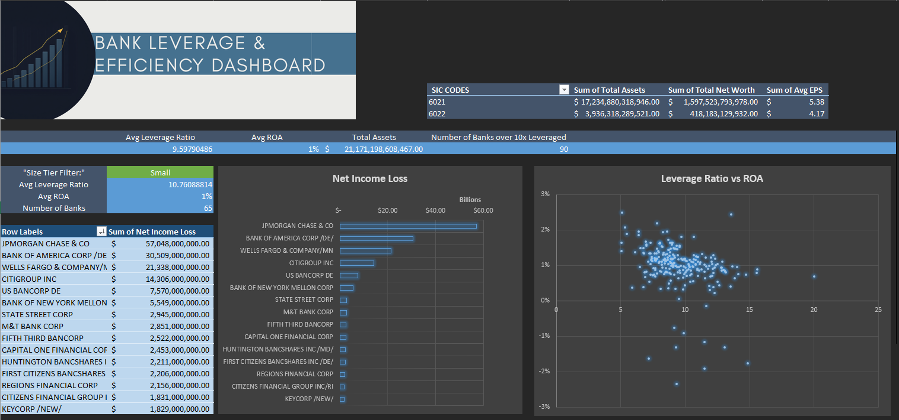

# Bank Leverage & Efficiency Dashboard

A one-sheet Excel dashboard that screens U.S. bank holding companies for leverage and
profitability risk, built from SEC EDGAR XBRL data for a set of 2025 10-K bank filers.

## Project Overview

This project takes raw SEC filing data for 242 bank holding companies (SIC codes 6021,
National Commercial Banks, and 6022, State Commercial Banks) and turns it into a compact,
interactive credit-risk screen: which banks are running the highest leverage, how that
relates to profitability (ROA), and how leverage and returns differ across bank size tiers
and charter types.

It was built as a short portfolio piece to demonstrate practical Excel skills, the kind
commonly screened for in entry-level data analyst postings, using a real, messy financial
dataset rather than a toy example.

## Business Framing: Why Leverage vs. Efficiency?

Rather than a generic "bank scorecard," the dashboard takes a credit-risk lens: **leverage
ratio (Assets / Stockholders' Equity)** paired against **ROA (Net Income / Assets)**. A bank
that is highly levered *and* has thin returns is the profile a credit analyst or regulator
would flag first. The dashboard highlights that intersection directly (see the "Number of
Banks over 10x Leveraged" KPI) rather than just ranking banks by size or profitability alone.

## Workbook Structure

| Sheet | Purpose |
|---|---|
| **Dashboard** | Summary KPIs, size-tier filter panel, and both charts. The main view. |
| **Pivot of State vs National** | Native Excel PivotTable rolling up Total Assets, Total Liabilities, Total Net Worth, and Avg EPS by SIC code (6021 vs 6022). Feeds the `State_v_National` sheet. |
| **State_v_National** | Reformats the pivot above into labeled rows (State Commercial Banks vs. National Commercial Banks) using `SUMIF`/`AVERAGEIF` against `dashboard_data_raw`. |
| **Bank Pivot** | Native Excel PivotTable ranking banks by Sum of Net Income Loss; source data for the Dashboard's net income chart. |
| **dashboard_data_raw** | The working table, one row per bank, pulling Assets, Liabilities, EPS, Interest, Net Income, and Stockholders' Equity via `GETPIVOTDATA` against the `financials_wide` pivot, then computing Leverage Ratio, ROA, Size Tier, and a net-income ranking for each bank. |
| **companies** | Filing metadata (CIK, name, SIC, fiscal year end, form type, period), one row per 10-K filer. Formatted as an Excel Table. |
| **financials_wide** | Native Excel PivotTable of the long-format XBRL data (tag x accession number), the source `GETPIVOTDATA` pulls from. |
| **financials** | The original long-format XBRL data (adsh, tag, value, etc.), one row per reported fact per filing. Formatted as an Excel Table. |

## Dashboard KPIs

- **Avg Leverage Ratio**, **Avg ROA**, and **Total Assets** across all banks in the sample
- **Number of Banks over 10x Leveraged**, a quick count of the higher-risk tail
- **Size Tier Filter**, a dropdown (Small / Mid / Large, based on asset quartile
  breakpoints) that recalculates average leverage ratio, average ROA, and bank count for
  the selected tier
- **Charts:** Leverage Ratio vs. ROA (scatter, relationship between the two), and Banks by
  Net Income/Loss (bar, top and bottom performers by dollar net income)

## Excel Skills Demonstrated

- **Pivot tables** - five native PivotTables in the workbook: one pivots the long-format
  XBRL data (`financials_wide`, tag x accession number) so individual line items can be
  looked up per company; one rolls up totals by SIC code (`Pivot of State vs National`);
  one ranks banks by net income (`Bank Pivot`); and two more sit behind the Dashboard's own
  SIC rollup and net-income chart
- **XLOOKUP** - pulls SIC, company name, and CIK into `dashboard_data_raw` (columns B-D),
  matching each filing's accession number (`adsh`) against the `companies` table
- **GETPIVOTDATA** - pulls Assets, EPS, Liabilities, Net Income, and Stockholders' Equity
  out of the `financials_wide` pivot for each bank by accession number, with an
  existence-checked fallback between two interest-income XBRL tags (`COUNTIFS` confirms
  which tag a filer used before `GETPIVOTDATA` pulls it, each wrapped in `IFERROR`)
- **LARGE + INDEX/MATCH** - `LARGE` generates each net-income rank value, and `INDEX/MATCH`
  looks up the corresponding bank name, feeding the "Bank by Net Income Loss" chart
- **SUMIF / AVERAGEIF** - rolls up totals and averages by SIC code (state vs. national
  charter) on the `State_v_National` sheet
- **SUMPRODUCT** - drives the Size Tier Filter panel, computing average leverage ratio and
  average ROA for whichever tier is selected in the dropdown, ignoring non-numeric cells
- **COUNTIF / COUNTIFS** - counts banks above the 10x leverage threshold, and counts banks
  within the selected size tier
- **QUARTILE.INC** - computes asset breakpoints to bucket banks into Small / Mid / Large
  tiers
- **AGGREGATE** - computes the overall (unfiltered) average leverage ratio, average ROA,
  and total assets KPIs while ignoring error values in the underlying calculated columns
- **Data validation** - dropdown list (Small/Mid/Large) driving the size-tier filter panel
- **Conditional formatting**, **Excel Tables**, and **charts** on the Dashboard sheet

### Data Model

Three tables loaded from the workbook — `companies` (filing metadata), `financials`
(long-format XBRL facts), and `dashboard_data_raw` (the per-bank table with Leverage Ratio,
ROA, and Size Tier already computed). `companies` and `financials` are related on the
accession number (`adsh`), so company name and SIC can slice the financial facts directly
instead of being pulled across with lookup formulas.

## Data Source

SEC EDGAR XBRL financial statement data (`companies.csv` / `financials.csv` equivalents,
loaded here as the `companies` and `financials` sheets) for 10-K filers under SIC 6021 and
6022, fiscal year end 2025-12-31.

## Known Data Notes

- A handful of banks (e.g., rows with all-blank Assets/Liabilities) didn't report one of the
  required XBRL tags for this period and fall out of the ratio calculations, this is
  expected with XBRL data and is handled with `IFERROR`/blank rather than hidden.
- A few Leverage Ratio cells are blank where Stockholders' Equity reported as zero, division
  by zero is caught by `IFERROR` rather than showing `#DIV/0!`.
- The "Bank / Net Income Loss / Rank" columns on `dashboard_data_raw` are a self-contained
  top-N ranking (by net income) used to feed the second chart, not part of the per-row bank
  record in columns A-O.

## How to Use

1. Open the workbook and go to the **Dashboard** sheet.
2. Use the **Size Tier Filter** dropdown (cell B15) to see average leverage, ROA, and bank
   count for Small, Mid, or Large banks.
3. Review the charts for the leverage/ROA relationship and top/bottom performers by net
   income.
4. Drill into `dashboard_data_raw` for the full per-bank detail behind the dashboard.
